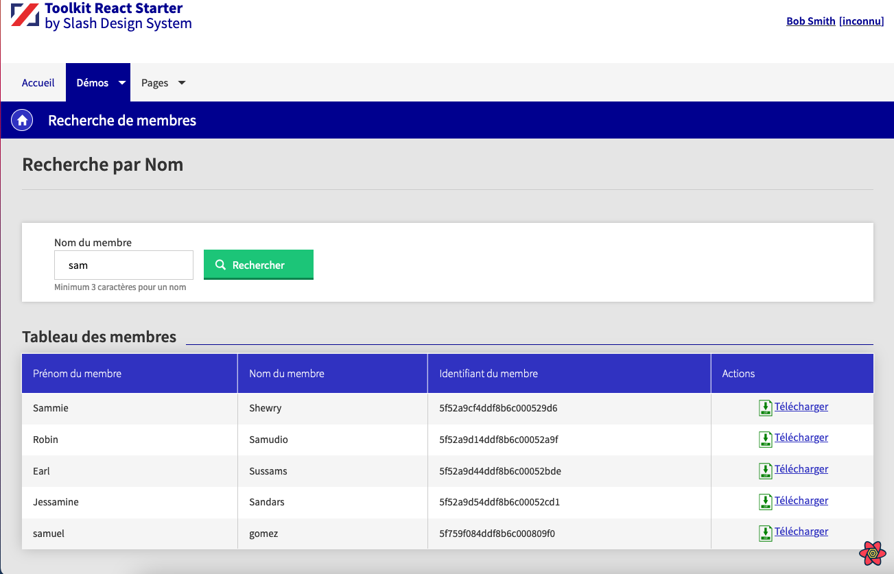
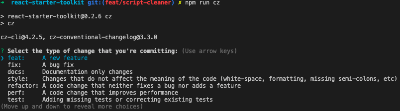

<p align="center" style="text-align: center;" ></p>
<h2 align="center" style="text-align: center;">React Starter Toolkit</h2>

<p style="text-align: center;">
<strong align="center" >A starter based on <a href="https://github.com/facebook/create-react-app" >Create React App</a> and Slash Design System (<a href="https://axaguildev.github.io/design-system/" >Guidelines</a>, <a href="https://axaguildev.github.io/react-toolkit/latest/storybook/?path=/story/alert-alert--default" >Storybook</a>)</strong>
<br><br>
<p align="center" style="text-align: center;">
<a href="https://github.com/samuel-gomez/react-starter-toolkit/actions/workflows/build.yml">
  
</a>
<a href="http://commitizen.github.io/cz-cli/">
  
</a>
</a>
<a href="https://codecov.io/gh/samuel-gomez/react-starter-toolkit">
  
</a>
</a>
<a href="https://app.netlify.com/sites/react-starter-toolkit/deploys">
  
</a>
</a>
<a href="https://sonarcloud.io/dashboard?id=samuel-gomez_react-starter-toolkit">
  
</a>
</a>
<a href="https://sonarcloud.io/component_measures?id=samuel-gomez_react-starter-toolkit&metric=reliability_rating">
  
</a>
<a href="https://sonarcloud.io/component_measures?id=samuel-gomez_react-starter-toolkit&metric=security_rating">
  
</a>
</p>

  <h2 align="center" style="text-align: center;">Demo 😎</h2>
<p align="center" style="text-align: center;">
  
</p>
  <p align="center" style="text-align: center;"><a href="https://react-starter-toolkit.netlify.app/">You can see a demo here</a></p>

## Installation 🚀

```
git clone https://github.com/samuel-gomez/react-starter-toolkit.git
```

> For VSCode users, you can open the workspace directly by double clicking on the app.code-workspace file

### 🚨 Before installation 🚨

If you want to clean this demo, you have to launch (node required):

```
npm run clean
```

This script delete all files of the demo (see the [CLEAN.md](./docs/CLEAN.md) file)

After that, you can run :

```
npm i
```

## Configuration ⚙️

After installation, you have to personalize some parameters, you can check it in the [CONFIG.md](./docs/CONFIG.md) file

## Available Scripts

In the project directory, you can run:

### `npm start` 🏁

Runs the app in the development mode.<br />
Open [http://localhost:9999](http://localhost:9999) to view it in the browser.

The page will reload if you make edits.<br />
You will also see any lint errors in the console.

### `npm test` or `npm t` 🔬

Launches the test runner in the interactive watch mode.<br />
See the section about [running tests](https://facebook.github.io/create-react-app/docs/running-tests) for more information.

### `npm run cover:local`

Launches the test runner with coverage and all warnings.

### `npm run cover` ☂

Launches the test runner with coverage and no warning (silent mode).

### `npm run test:sonar` 🗼

Launches the test runner for sonar report.

### `npm run build` 📦

Builds the app for production to the `build` folder.<br />
It correctly bundles React in production mode and optimizes the build for the best performance.

The build is minified and the filenames include the hashes.<br />
Your app is ready to be deployed!

### `npm run cz` ⛩

If you want a helper to respect the conventional commits naming, Commitizen give a cli interface.



### `npm run lint` 👮‍♂️

Script to launch eslint analyse.

With these plugins :

```json
"extends": [
    "react-app",
    "plugin:prettier/recommended",
    "plugin:@typescript-eslint/recommended"
  ],
  "plugins": [
    "prettier",
    "@typescript-eslint"
  ],
```

### `npm run lint:fix` 👮‍♂️⛑

Script to launch eslint analyse with auto fix.

### `npm run prettier` 🎩

Script to launch prettier analyse.

### `npm run prettier:fix` 🎩⛑

Script to launch prettier analyse with auto fix.

### `npm run check` 👍

Script to launch eslint analyse and prettier analyse with auto fix.

### `npm run prepare` 🐶

Script to launch husky installation, it's launched during the global installation.

## Issues 🐞

If you detect a bug, please create an issue :
https://github.com/samuel-gomez/react-starter-toolkit/issues

## Quality 💎

### SonarCloud

https://sonarcloud.io/project/overview?id=samuel-gomez_react-starter-toolkit
